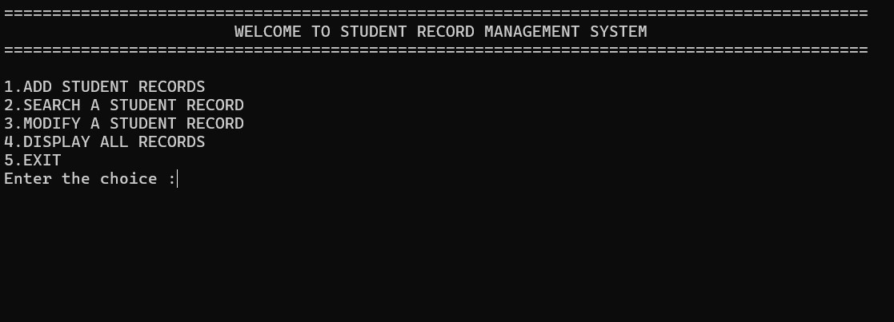
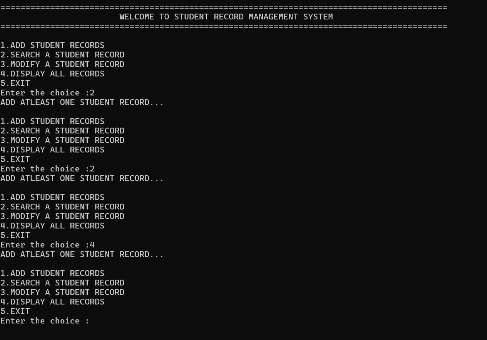
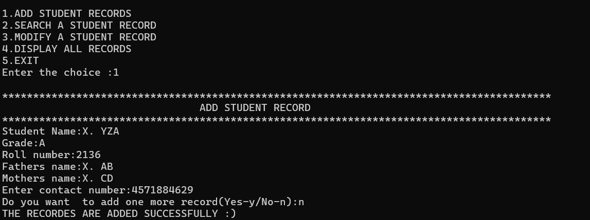
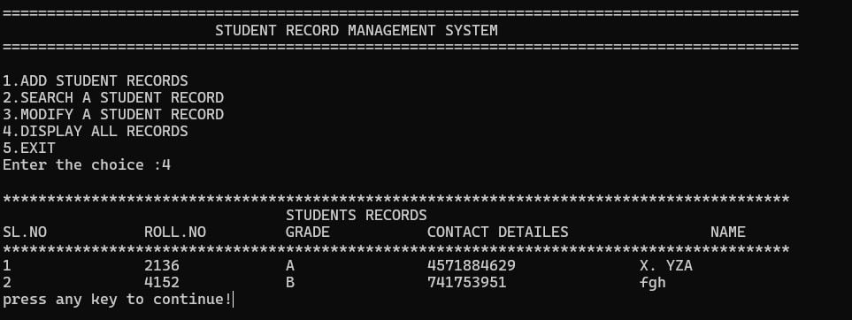

<h1>Student Record Management System</h1>
# A console-based student record management system implemented in C.

## Concepts Used

This project utilizes several key concepts and technologies:

- Implemented in **C Programming Language** for efficiency and low-level control.
- **Dynamic Memory Allocation** (`malloc`, `realloc`, `free`) is used to manage memory for student records.
- **File Handling**: Student records are stored and retrieved using file handling techniques.
- **Console-Based Interface**: Users interact with the program through a text-based menu and commands.
- **Structures**: Data is structured using `struct studentrecord` to store information about each student.
- **Functions and Modularity**: The program is modularized with functions for adding, searching, modifying, and displaying student records.
- **User Input Handling**: Input validation ensures correct data entry and program behavior.
- **Compilation and Execution**: Instructions are provided to compile and run the program on different platforms (Windows, Linux, macOS).

## Key Highlights

- **Efficient C Implementation**: This project showcases the power and efficiency of the C programming language for handling complex data management tasks.
- **Dynamic Memory Management**: Utilizes dynamic memory allocation to efficiently manage varying numbers of student records.
- **Interactive Console Interface**: Provides a user-friendly, text-based interface for easy interaction and navigation.
- **Comprehensive Record Management**: Includes features to add, search, modify, and display student records, making it a versatile tool for managing student information.
- **Robust Data Structures**: Leverages C structures (`struct`) to organize and manage student data effectively.
- **Cross-Platform Compatibility**: Compatible with major operating systems including Windows, Linux, and macOS, thanks to the use of standard C libraries.
- **Modular Code Design**: Structured with modular functions to promote code reusability and maintainability.
- **Detailed Documentation**: Comes with clear and detailed documentation to assist users in installation, usage, and understanding the codebase.


## Features

- ✨ Add, search, modify, and display student records
- 📊 Interactive menu for user-friendly navigation
- 🛠️ Easy installation and setup with clear instructions
- 🌐 Cross-platform compatibility (Windows, Linux, macOS)

## Installation

1. Clone the repository:
   ```bash
   git clone https://github.com/kothapallysidhartha/Student-Record-Management-System.git
   cd Student-Record-Management-System
2. Compile the program:  
   ```bash
   gcc main.c functions.c -o student_records
3. Run the program:
      ```bash
      ./student_records
Running the Program
Once you have compiled and executed the program, follow these steps to manage student records:

Upon starting the program, you will see an interactive menu with options such as adding, searching, modifying, and displaying student records.

Choose an option by entering the corresponding number and follow the prompts provided by the program.

Example Demo
Here's a quick demo showing how to add and search for a student record:

_Figure 1: The main interface showing the student records management menu._

In this demo:

The program starts with an empty record set.
The user adds a new student record by entering details such as name, grade, roll number, parent names, and contact information.
After adding the record, the user searches for the record using the roll number to verify its addition.

## Screenshots

Here are some screenshots from the application:


_Figure 1: The main interface showing the student records management menu._


_Figure 2: Adding a new student record to the database._


_Figure 3: Searching for a student record and displaying the results._


<br>
_Figure 4:  displaying all  the records._

## Detailed Usage Instructions

After running the program, you will be presented with an interactive menu. Here's how you can use the main features:

### Adding a Student Record

1. Select option `1` from the main menu.
2. Enter the student's name, grade, roll number, father's name, mother's name, and contact number when prompted.
3. Confirm the addition of the record.

### Searching for a Student Record

1. Select option `2` from the main menu.
2. Enter the roll number of the student you want to search for.
3. The program will display the student's details if the record is found.

### Modifying a Student Record

1. Select option `3` from the main menu.
2. Enter the roll number of the student whose record you want to modify.
3. Update the grade and contact number as needed.

### Displaying All Student Records

1. Select option `4` from the main menu.
2. The program will display a list of all student records currently stored.

### Exiting the Program

1. Select option `5` to exit the program.


   


